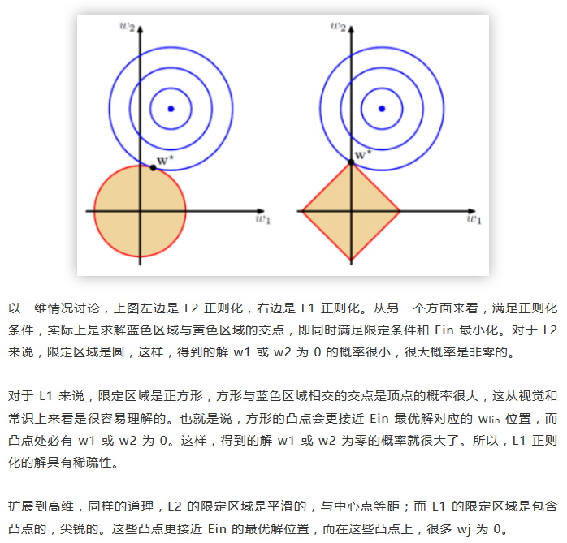

# Regression
线性回归  
__优点__： 结果易于理解，计算不复杂  
__缺点__： 对非线性的数据拟合不好  
__适用数据类型__： 数值型和标称型数据  

标准线性回归
----

局部加权线性回归
----

权重矩阵采用高斯核

岭回归
----
属于缩减法的一种
不能求逆时，一般指属性比样本数多的情况，用岭回归需要数据标准化

限制了所有W之和，通过引入惩罚项，能够减少不必要的参数,增加了偏差，减少了方差

前向逐步回归
----
效果和缩减方法lasso差不多但更为简单，设定初始化W和步长，逐步迭代W,取最小误差

岭回归与lasso回归的区别
----
岭回归使用l2正则化（就是平方和），lasso回归使用L1正则化（就是绝对值和）。
L2正则化易于求导，简化计算，更加常用
L1正则化能得到较稀疏的解，但缺点是不易求导  

